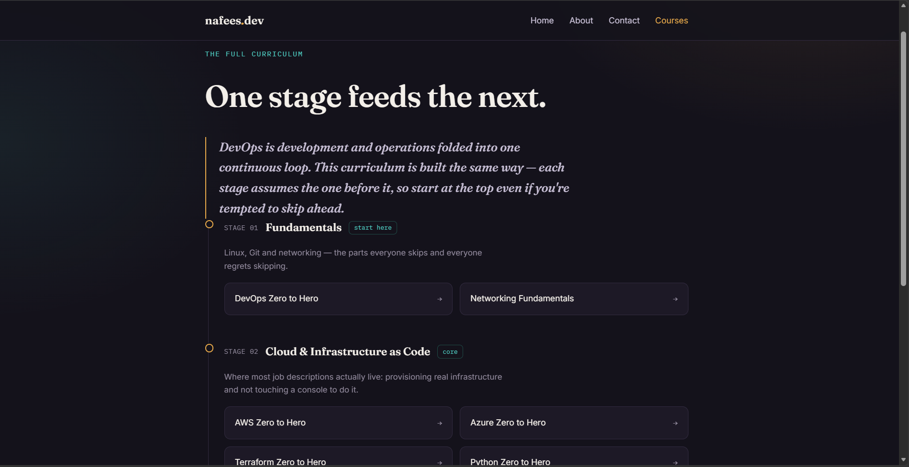

# Go Web App — Helm + GitOps Delivery to AWS EKS

A Go web application shipped through a fully automated GitOps pipeline: Dockerized,
packaged with a custom Helm chart, and delivered to AWS EKS via GitHub Actions + Argo CD.
Every push to `main` builds, tags, and deploys — no manual `kubectl` or `helm upgrade`.

<!-- Replace this line with whichever is true — don't leave both options in -->
> Deployed onto the same EKS cluster provisioned in my [Microservices-Deployment](link) project —
> see that repo for the Terraform/cluster setup.
> **OR:** Cluster provisioned separately via Terraform in [repo link] — [one line on why separate].

## Running Locally
```bash
go run main.go
```
Visit `http://localhost:8080/courses` in your browser.



## What This Project Demonstrates
- Multi-stage Dockerfile for a minimal, production-style Go image
- A custom Helm chart (`helm/go-web-app`) for repeatable, version-controlled releases
- Git write-back GitOps: GitHub Actions builds and tags the image on push; Argo CD syncs
  the cluster to match — the pipeline never touches the cluster directly
- Unit tests (`main_test.go`) run in CI before an image is built

## Pipeline Flow
1. Push to `main` → GitHub Actions runs `go test`, builds the Docker image, tags it with the commit SHA, pushes to <!-- registry: GHCR/Docker Hub? -->
2. <!-- write-back step updates the tag in Git, OR Argo CD Image Updater picks up the new tag — say which -->
3. Argo CD detects the change and syncs the cluster

## Design Decisions
- **Helm over raw manifests** — <!-- your real reason -->
- **Argo CD over deploying from CI** — same GitOps principle as my EKS project: Git stays the
  single source of truth, CI never holds cluster credentials
- <!-- one more, if you made a deliberate choice different from your other project -->

## Tech Stack
| Layer | Tools |
|---|---|
| Language | Go |
| Containers | Docker |
| Packaging | Helm |
| CI | GitHub Actions |
| CD | Argo CD |
| Orchestration | AWS EKS |

## What I Learned / Challenges
- <!-- one real specific — e.g. a Helm templating issue, or the write-back step's commit loop -->

## Status
Portfolio project — <!-- running / torn down to avoid AWS costs -->
